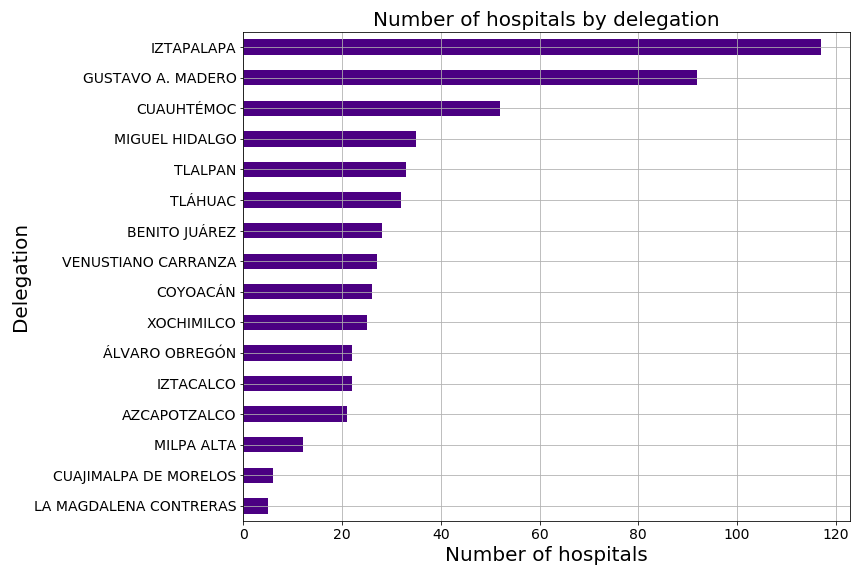
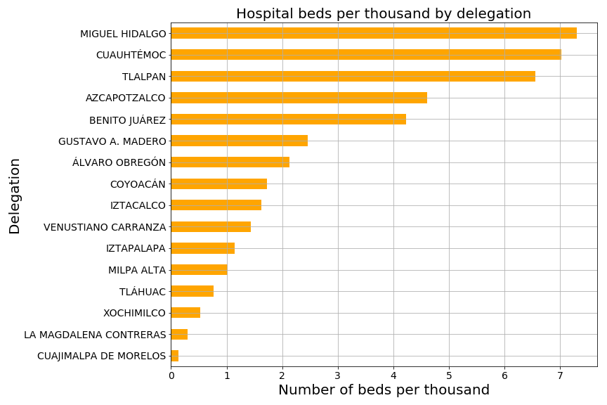
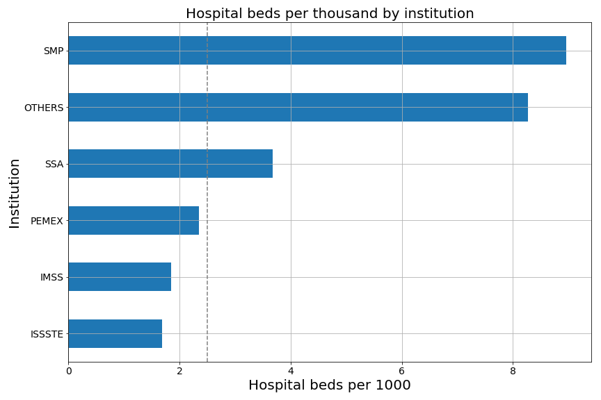
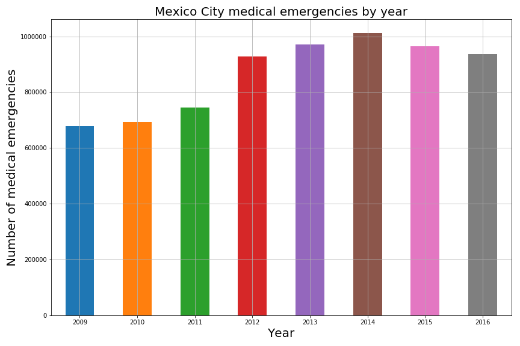
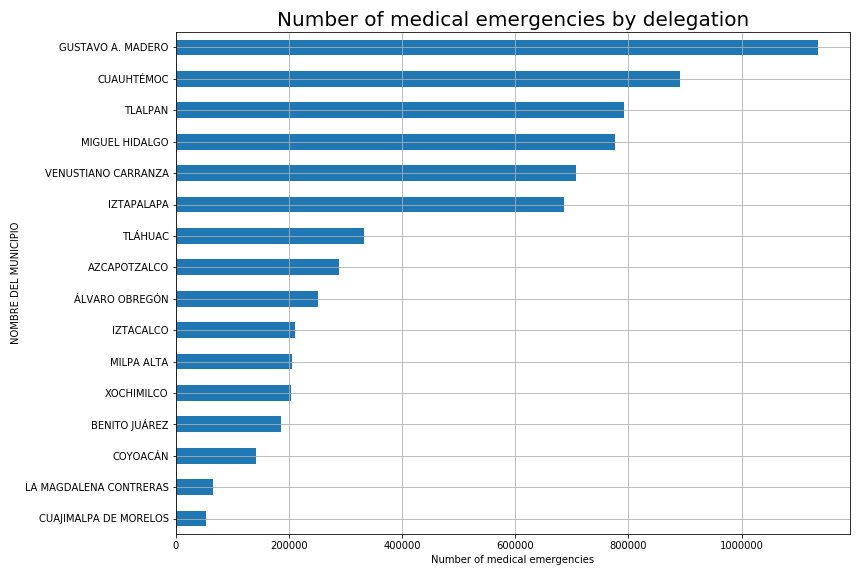
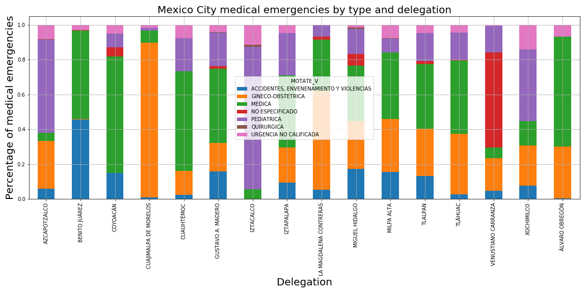
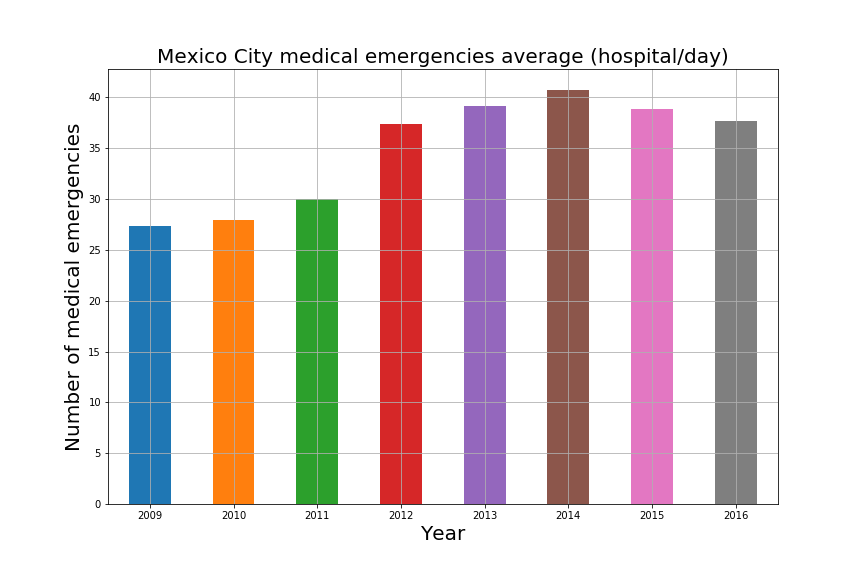

# Healthcare Data Analysis

## Authors 
* Joanne Peel - [LinkedIn](https://www.linkedin.com/in/joanne-peel/) - [GitHub](https://github.com/JoannePeel)
* Daniel Cespedes - [LinkedIn](https://www.linkedin.com/in/selinzorob/) - [GitHub](https://github.com/danielczz)
* Joel Sotelo - [LinkedIn](https://www.linkedin.com/in/joelsotelods/) - [GitHub](https://github.com/joelsotelods)

## Project Outline
The Mexican healthcare system is divided into two sectors: **private and public**. 

According to article 4° of the Mexican political constitution healthcare is a **basic right of all Mexican citizens**. 

Workers who are or were employed formally, as well as their families, receive healthcare from social security institutions: 

- 80% of this population is covered by _Instituto Mexicano del Seguro Social (IMSS)_.
- 18% of this population is covered by _Instituto de Seguridad y Servicios Sociales de los Trabajadores del Estado (ISSSTE)_.
- The rest is covered by other institutions: _Petróleos Mexicanos (PEMEX)_, _Secretaría de la Defensa Nacional (SEDENA)_, and _Secretaría de Marina (SEMAR)_.


People without social security fall under the responsibility of the _Secretary for Health (SSA)_ and represent about half of the population of the country. In 2008, there were: 
- **27 million insurance seekers affiliated to SSA.**
- **30 million people without healthcare insurance.**

**Mexico’s emergency departments** have faced an important increment in patients, with **5,751,797 patients in 2008**, and almost twice the amount: **10,645,625 patients in 2014**. To deal with the increased patient load Mexican hospitals implement triage systems. 

**Triage**, a concept developed and refined on the battlefield, has been central to the practice of emergency medicine for more than half a century. As _Emergency departments (EDs)_ face escalating patient volumes, persistent crowding, and patient populations with more complex disease, the need for accurate and reliable triage has intensified.

**Triage systems** with published evidence of widespread adoption include: 
- Australasian Triage Scale (ATS). 
- Canadian Triage and Acuity Scale (CTAS). 
- Emergency Severity Index (ESI).
- Manchester Triage Scale (MTS). 
- South African Triage Scale (SATS) and NEWS2. 

Currently, Mexican hospitals use **Manchester Triage Scale (MTS)**.

Two thirds of Mexico's population is urbanized and 35% of the population lives in nine metropolitan areas. Therefore, the objectives of this project were to analyze data from _Instituto Nacional de Estadística y Geografía (INEGI)_ and _Secretary for Health (SSA)_: 

1. To determine the number of people insured by each institution in Mexico City (IMSS, ISSSTE, SSA and others).

2. To determine the number and distribution of hospitals in the city and the institutions they belong to.

3. To determine the number of hospital beds per 1000 capita by institution (based on insured population) and by delegation (based on population).

4. To analyze the number of emergencies attended in Mexico City in the period from 2009-2016. 

5. To calculate the increment rate of demand on emergency services. 

6. To quantify emergencies by type and delegation.

Lastly, for the final phase of this project we are going to propose an _Electronic Case Report (eCRF)_, for emergency room admission, which will automatically calculate different Triage scales (MTS, NEWS2, MEWS for pregnant women, and PEWS for pediatric patients) and facilitate ordered attendance of a large number of patients.

Our hypothesis are that the public healthcare institutions face a high demand of patients (low beds per capita index); that demand of emergency services is increasing; and that a large number of emergencies attended in hospitals are unqualified emergencies.

---

## Research Questions to Answer & Data Sets to be Used

1.	How many people in Mexico City have insurance through each of the public institutions institution in Mexico City (IMSS, ISSSTE, SSA and others)? 
    
    Data: [INEGI](https://www.inegi.org.mx/app/tabulados/pxweb/inicio.html?rxid=857b90d2-9e40-4741-8e2e-a5655d78437e&db=Derechohabiencia&px=Derechohabiencia_02)


2.	How many hospitals are there in Mexico City, where are they distributed (delegations), and which institutions they belong to?

    Data: [DGIS](http://www.dgis.salud.gob.mx/contenidos/intercambio/clues_gobmx.html) 

3.	How many hospital beds per 1000 capita are there by institution (based on insured population) and by delegation (based on population)?
    
    Data: [DGIS_Institution](http://www.dgis.salud.gob.mx/contenidos/intercambio/clues_gobmx.html) | Data: [INEGI tabulados](https://www.inegi.org.mx/app/tabulados/pxweb/inicio.html?rxid=857b90d2-9e40-4741-8e2e-a5655d78437e&db=Derechohabiencia&px=Derechohabiencia_02) | Data: [INEGI per capita](http://internet.contenidos.inegi.org.mx/contenidos/productos/prod_serv/contenidos/espanol/bvinegi/productos/nueva_estruc/anuarios_2015/702825076924.pdf)

4.	How many emergencies did each of the institutions attend in Mexico City in the period from 2009-2016?
    
    Data: [Datos Gobierno Mexico](https://datos.gob.mx/busca/dataset/urgencias) 

5.	How much did the demand on emergency services increase in the 7 years analyzed?  
    
    Data: [Datos Gobierno Mexico](https://datos.gob.mx/busca/dataset/urgencias)

6.	Which were the most frequent emergencies? Which delegation attended more emergencies and what kind?

    Data: [Datos Gobierno Mexico](https://datos.gob.mx/busca/dataset/urgencias)
    | Data: [DGIS_Salud](http://www.dgis.salud.gobmx/contenidos/intercambio/clues_gobmx.html)

---

## Breakdown of Tasks

### **INEGI Data analysis** 
    
1. To get the information from the INEGI and government websites.

2. Understand, filter and cleanup the data, using **Pandas** dataframes.

3. Visualize the results using **matplotlib**.

### **Data Cleanup & Exploration**


To see the complete code solution: [Healthcare Data Analysis](main.ipynb)

### Importing libraries


```python
# get_ipython().run_line_magic('matplotlib', 'inline')
import matplotlib.pyplot as plt
import pandas as pd
import numpy as np
```

### Dataload

```python
hospital_data_to_load = "data_input/hospitals.csv"
hospitals = pd.read_csv(hospital_data_to_load, encoding='latin-1')
```

```python
hospitals_cdmx1 = hospitals.loc[(hospitals["NOMBRE DE LA ENTIDAD"] == "CIUDAD DE MEXICO")]

hospitals_cdmx = hospitals_cdmx1.loc[(hospitals_cdmx1["NOMBRE TIPO ESTABLECIMIENTO"] == "DE HOSPITALIZACIÓN")]

cdmx_hospitals = hospitals_cdmx[['CLUES', 'NOMBRE DE LA ENTIDAD', 'NOMBRE DEL MUNICIPIO', 'NOMBRE DE LA LOCALIDAD',
       'NOMBRE DE LA JURISDICCION', 'CLAVE DE LA INSTITUCION', 'NOMBRE DE TIPOLOGIA', 'CONSULTORIOS DE MED GRAL', 'CONSULTORIOS EN OTRAS AREAS',
       'TOTAL DE CONSULTORIOS', 'CAMAS EN AREA DE HOS', 'CAMAS EN OTRAS AREAS',
       'TOTAL DE CAMAS', 'NOMBRE DE LA UNIDAD', 'OBSERVACIONES DE LA DIRECCION', 'CODIGO POSTAL',
       'ESTATUS DE OPERACION', 'LONGITUD', 'LATITUD', 'NIVEL ATENCION']]

```

| ID    | CLUES       | NOMBRE DE LA ENTIDAD | NOMBRE DEL MUNICIPIO | NOMBRE DE LA LOCALIDAD | NOMBRE DE LA JURISDICCION | CLAVE DE LA INSTITUCION | NOMBRE DE TIPOLOGIA            | CONSULTORIOS DE MED GRAL | CONSULTORIOS EN OTRAS AREAS | TOTAL DE CONSULTORIOS | CAMAS EN AREA DE HOS | CAMAS EN OTRAS AREAS | TOTAL DE CAMAS | NOMBRE DE LA UNIDAD                               | OBSERVACIONES DE LA DIRECCION                     | CODIGO POSTAL | ESTATUS DE OPERACION | LONGITUD    | LATITUD    | NIVEL ATENCION | 
|------|-------------|----------------------|----------------------|------------------------|---------------------------|-------------------------|--------------------------------|--------------------------|-----------------------------|-----------------------|----------------------|----------------------|----------------|---------------------------------------------------|---------------------------------------------------|---------------|----------------------|-------------|------------|----------------| 
| 6399 | DFCRO000011 | CIUDAD DE MEXICO     | MIGUEL HIDALGO       | MIGUEL HIDALGO         | MIGUEL HIDALGO            | CRO                     | NO ESPECIFICADO                | 5                        | 0                           | 5                     | 60                   | 0                    | 60             | CENTRO DE TRAUMA DE CRUZ ROJA MEXICANA EN EL D... | AV. EJÉRCITO NACIONAL NO. 1032, COLONIA LOS MO... | 11510.0       | EN OPERACION         | -99.2088913 | 19.4385309 | SEGUNDO NIVEL  | 
| 6505 | DFIMS000020 | CIUDAD DE MEXICO     | AZCAPOTZALCO         | AZCAPOTZALCO           | AZCAPOTZALCO              | IMSS                    | HOSPITAL DE ESPECIALIDADES     | 75                       | 0                           | 75                    | 465                  | 0                    | 465            | HES CM LA RAZA                                    | SERIS Y ZAACHILA COL. LA RAZA C.P. 02990, AZC...  | 2990.0        | EN OPERACION         | -99.1442    | 19.4662    | TERCER NIVEL   | 
| 6507 | DFIMS000044 | CIUDAD DE MEXICO     | AZCAPOTZALCO         | AZCAPOTZALCO           | AZCAPOTZALCO              | IMSS                    | HOSPITAL DE GINECO-OBSTETRICIA | 31                       | 0                           | 31                    | 306                  | 0                    | 306            | HGO CM LA RAZA                                    | CLZD. VALLEJO ESQ. ANTONIO VALERIANO COL. LA ...  | 2990.0        | EN OPERACION         | -99.1470262 | 19.4664404 | SEGUNDO NIVEL  | 
| 6508 | DFIMS000056 | CIUDAD DE MEXICO     | AZCAPOTZALCO         | AZCAPOTZALCO           | AZCAPOTZALCO              | IMSS                    | HOSPITAL INFECTOLOGÍA          | 6                        | 0                           | 6                     | 148                  | 0                    | 148            | HINFEC CM LA RAZA                                 | ZAACHILA Y JACARANDAS S/N COL. LA RAZA C.P. 0...  | 2990.0        | EN OPERACION         | -99.144716  | 19.466279  | TERCER NIVEL   | 
| 6509 | DFIMS000061 | CIUDAD DE MEXICO     | AZCAPOTZALCO         | AZCAPOTZALCO           | AZCAPOTZALCO              | IMSS                    | HOSPITAL GENERAL               | 69                       | 0                           | 69                    | 523                  | 0                    | 523            | HG CM LA RAZA                                     | CLZD. VALLEJO Y JACARANDAS COL. LA RAZA C.P. ...  | 2990.0        | EN OPERACION         | -99.182     | 19.486     | SEGUNDO NIVEL  | 


```python
cdmx_hospitals = cdmx_hospitals.loc[(cdmx_hospitals["ESTATUS DE OPERACION"] == "EN OPERACION")]
cdmx_hospitals = cdmx_hospitals.loc[(cdmx_hospitals["TOTAL DE CAMAS"] != 0)]
cdmx_hospitals.to_csv('data_output/cdmx_hospitals.csv')
```

## Insured population cdmx


```python
insurance_data_to_load = "data_input/insured_population.csv"
population_insured = pd.read_csv(insurance_data_to_load)
population_insured.set_index('CLAVE DE LA INSTITUCION', inplace=True)
pop_data_to_load = "data_input/population_cdmx.csv"
population = pd.read_csv(pop_data_to_load)
```


```python
Total_pop = population['Total'].sum()
Total_insured = population_insured["population_insured"].sum()
Uninsured = Total_pop - Total_insured
no_insurance = pd.DataFrame({"population_insured": [Uninsured]})
```


```python
percent_uninsured = (Uninsured/Total_pop)*100
#print(percent_uninsured)
cdmx_insurance = population_insured.append(no_insurance)
cdmx_insurance = cdmx_insurance.rename(index={0:'UNINSURED'})
cdmx_insurance["Percent_insured"] = (population_insured/Total_pop)*100
cdmx_insurance.loc["UNINSURED", ("Percent_insured")] = "18.676512"
cdmx_insurance["Percent_insured"] = pd.to_numeric(cdmx_insurance["Percent_insured"])
cdmx_insurance = cdmx_insurance.sort_values("Percent_insured", ascending=True)
cdmx_insurance
```

|      | population_insured | Percent_insured | 
|-----------|--------------------|-----------------| 
| PEMEX     | 101922             | 1.151520        | 
| OTHERS    | 152621             | 1.724321        | 
| SMP       | 605038             | 6.835753        | 
| ISSSTE    | 1096209            | 12.385031       | 
| UNINSURED | 1653073            | 18.676512       | 
| SSA       | 2009093            | 22.698846       | 
| IMSS      | 3233124            | 36.528017       | 


## Beds per capita (institutions)

```python
#Import data
hospital_data_to_load = "data_output/cdmx_hospitals.csv" #data generated from "Data cleaning"
cdmx_hospitals = pd.read_csv(hospital_data_to_load, encoding='latin-1')
insurance_data_to_load = "data_input/insured_population.csv" #Data from INEGI "derechohabiencia cdmx 2015"
population_insured = pd.read_csv(insurance_data_to_load)
population_insured.set_index('CLAVE DE LA INSTITUCION', inplace=True)
bed_data_to_load = "data_input/comparison_beds.csv" #Data from www.nationmaster.com/country-info/stats/Health/Hospital-beds/Per-1%2C000-people
comparison_beds = pd.read_csv(bed_data_to_load)
comparison_beds.set_index('CLAVE DE LA INSTITUCION', inplace=True)
```


```python
#Dataframe number of beds/institution
cdmx_hospitals = cdmx_hospitals.rename(columns={"TOTAL DE CAMAS":"camas"})
hospitals_inst = pd.DataFrame(cdmx_hospitals.groupby(["CLAVE DE LA INSTITUCION"]).camas.sum()) 
```


```python
#Combine rare institutions in category "other"
hospitals_institutions = hospitals_inst.loc[["IMSS", "ISSSTE", "PEMEX", "SMP", "SSA"]]
others = hospitals_inst.loc[["CRO", "SEDENA", "SEMAR", "SME"]]
OTHERS = others["camas"].sum()
other_inst = pd.DataFrame({"camas": [OTHERS]})
other_inst = other_inst.rename(index={0:'OTHERS'})
hospitals_all_beds = hospitals_institutions.append(other_inst)
```


```python
#Dataframe number of hospitals/institution
cdmx_hospitals = cdmx_hospitals.rename(columns={"NOMBRE DE LA UNIDAD":"nombre_hospital"})
hospitals_number_all = pd.DataFrame(cdmx_hospitals.groupby(["CLAVE DE LA INSTITUCION"]).nombre_hospital.count())
```


```python
#Combine rare hospitals in category "other"
hospitals_number = hospitals_number_all.loc[["IMSS", "ISSSTE", "PEMEX", "SMP", "SSA"]]
number_others1 = hospitals_number_all.loc[["CRO", "SEDENA", "SEMAR", "SME"]]
numb_others = number_others1["nombre_hospital"].sum()
numb_others = pd.DataFrame({"nombre_hospital": [numb_others]})
numb_others = numb_others.rename(index={0:'OTHERS'})
hospitals_all_number = hospitals_number.append(numb_others)
```


```python
#Combine dataframes 
df_institutions = hospitals_all_number.join(hospitals_all_beds, how="outer")
df_institutions = df_institutions.rename(columns={"nombre_hospital" : "number_of_hospitals"})
df_institutions = df_institutions.join(population_insured, how="outer")
```


```python
#Add a column containing the bed per capita index
df_institutions['beds per 1000'] = (df_institutions['camas']/df_institutions['population_insured'])*1000
df_institutions
```

| CLAVE DE LA INSTITUCION | number_of_hospitals | camas   | population_insured | beds per 1000 |
|-------------------------|-----|---------------------|---------|--------------------|
| IMSS                    | 29  | 5989                | 3233124 | 1.852388           |
| ISSSTE                  | 8   | 1848                | 1096209 | 1.685810           |
| PEMEX                   | 2   | 240                 | 101922  | 2.354742           |
| SMP                     | 451 | 5420                | 605038  | 8.958115           |
| SSA                     | 55  | 7390                | 2009093 | 3.678277           |
| OTHERS                  | 11  | 1262                | 152621  | 8.268849           |


```python
#Sort values for plots/summary table
beds= df_institutions.sort_values("beds per 1000", ascending=False)
beds.to_csv('data_output/beds_per_capita.csv') #save summary table to csv
sum_beds = beds[["camas"]]
sum_beds = sum_beds.sort_values("camas", ascending=False)
```


```python
avrg_beds = df_institutions["beds per 1000"].mean()
```


```python
beds_plot = beds[['beds per 1000']]
beds_plot = beds_plot.sort_values("beds per 1000", ascending=True)
```


```python
hospitals = df_institutions[["number_of_hospitals"]]
hospitals = hospitals.sort_values("number_of_hospitals", ascending=True)
```


```python
#dataframe adding comparative values
beds_compared = beds_plot.append(comparison_beds)
beds_compared = beds_compared.sort_values("beds per 1000", ascending=True)
beds_compared
```

| CLAVE DE LA INSTITUCION | beds per 1000 | 
|-------------------------|---------------| 
| EL SALVADOR AVERAGE     | 1.650000      | 
| ISSSTE                  | 1.685810      | 
| IMSS                    | 1.852388      | 
| PEMEX                   | 2.354742      | 
| USA AVERAGE             | 3.300000      | 
| SSA                     | 3.678277      | 
| EUROPEAN UNION AVERAGE  | 6.420000      | 
| OTHERS                  | 8.268849      | 
| SMP                     | 8.958115      | 


### Beds per capita (delegaciones)

```python
hospital_data_to_load = "data_output/cdmx_hospitals.csv"

cdmx_hospitals_df = pd.read_csv(hospital_data_to_load)
```


```python
#How many beds are in CDMX
total_beds_cdmx = cdmx_hospitals_df["TOTAL DE CAMAS"].sum()

#Group info by delegation 
cdmx_by_delegation = cdmx_hospitals_df.groupby(['NOMBRE DEL MUNICIPIO'])

#How many beds are in CDMX by delegation
total_beds_by_delegation = cdmx_by_delegation["TOTAL DE CAMAS"].sum()

# Place total_beds_by_delegation dataseries into in a Pandas DataFrame
total_df_beds = pd.DataFrame(data=total_beds_by_delegation)

#How many hospitals are in CDMX by delegation
total_hospitals_by_delegation = cdmx_by_delegation["NOMBRE DE LA UNIDAD"].nunique()

# Place total_hospitals_by_delegation dataseries into a Pandas DataFrame
total_df_hospitals = pd.DataFrame(data = total_hospitals_by_delegation)
```

```python
total_df_beds['TOTAL DE HOSPITALES'] = total_df_hospitals
```


```python
population_file = "data_input/population_cdmx.csv"

cdmx_population_df = pd.read_csv(population_file)
cdmx_population_df = cdmx_population_df.rename(columns={'Delegación': 'NOMBRE DEL MUNICIPIO', 'Total': 'TOTAL DE HABITANTES'})

cdmx_population_df.set_index('NOMBRE DEL MUNICIPIO', inplace=True) 
cdmx_population_df

total_df_beds = total_df_beds.join(cdmx_population_df, how="outer")
```


```python
total_df_beds['BEDS PER 1000'] = total_df_beds['TOTAL DE CAMAS']/total_df_beds['TOTAL DE HABITANTES']*1000

total_df_beds['BEDS PER 1000'] = total_df_beds['BEDS PER 1000'].map("{:,.2f}".format)
total_df_beds

total_df_beds.to_csv('data_output/beds_hospitals_by_delegation.csv') 
total_df_beds["BEDS PER 1000"] = pd.to_numeric(total_df_beds["BEDS PER 1000"])
total_df_beds
```

|   NOMBRE DEL MUNICIPIO | TOTAL DE CAMAS | TOTAL DE HOSPITALES | TOTAL DE HABITANTES | BEDS PER 1000 | 
|------------------------|----------------|---------------------|---------------------|---------------| 
| AZCAPOTZALCO           | 1910           | 21                  | 414711              | 4.61          | 
| BENITO JUÁREZ          | 1631           | 28                  | 385439              | 4.23          | 
| COYOACÁN               | 1073           | 26                  | 620416              | 1.73          | 
| CUAJIMALPA DE MORELOS  | 24             | 6                   | 186391              | 0.13          | 
| CUAUHTÉMOC             | 3735           | 52                  | 531831              | 7.02          | 
| GUSTAVO A. MADERO      | 2916           | 92                  | 1185772             | 2.46          | 
| IZTACALCO              | 623            | 22                  | 384326              | 1.62          | 
| IZTAPALAPA             | 2065           | 117                 | 1815786             | 1.14          | 
| LA MAGDALENA CONTRERAS | 72             | 5                   | 239086              | 0.30          | 
| MIGUEL HIDALGO         | 2723           | 35                  | 372889              | 7.30          | 
| MILPA ALTA             | 133            | 12                  | 130582              | 1.02          | 
| TLALPAN                | 2364           | 33                  | 360265              | 6.56          | 
| TLÁHUAC                | 497            | 32                  | 650567              | 0.76          | 
| VENUSTIANO CARRANZA    | 619            | 27                  | 430978              | 1.44          | 
| XOCHIMILCO             | 216            | 25                  | 415007              | 0.52          | 
| ÁLVARO OBREGÓN         | 1548           | 22                  | 727034              | 2.13          | 


```python
df = cdmx_hospitals_df.groupby(["NOMBRE DEL MUNICIPIO","CLAVE DE LA INSTITUCION"]).count()
df_stacked = df.pivot_table(values = "NOMBRE DE LA ENTIDAD", index = "NOMBRE DEL MUNICIPIO", columns = "CLAVE DE LA INSTITUCION", aggfunc="sum")
df_stacked
```

| NOMBRE DEL MUNICIPIO    | CRO | IMSS | ISSSTE | PEMEX | SEDENA | SEMAR | SME | SMP   | SSA  | 
|-------------------------|-----|------|--------|-------|--------|-------|-----|-------|------| 
| AZCAPOTZALCO            | NaN | 5.0  | NaN    | 1.0   | NaN    | NaN   | NaN | 13.0  | 2.0  | 
| BENITO JUÁREZ           | NaN | 3.0  | 2.0    | NaN   | NaN    | NaN   | NaN | 22.0  | 1.0  | 
| COYOACÁN                | NaN | 2.0  | NaN    | NaN   | NaN    | 1.0   | NaN | 21.0  | 2.0  | 
| CUAJIMALPA DE MORELOS   | NaN | NaN  | NaN    | NaN   | NaN    | NaN   | NaN | 6.0   | NaN  | 
| CUAUHTÉMOC              | NaN | 6.0  | NaN    | NaN   | 1.0    | NaN   | NaN | 40.0  | 5.0  | 
| GUSTAVO A. MADERO       | NaN | 6.0  | 1.0    | NaN   | NaN    | NaN   | NaN | 78.0  | 7.0  | 
| IZTACALCO               | NaN | 2.0  | NaN    | NaN   | NaN    | NaN   | NaN | 19.0  | 1.0  | 
| IZTAPALAPA              | NaN | 2.0  | 2.0    | NaN   | 1.0    | NaN   | 1.0 | 105.0 | 6.0  | 
| LA MAGDALENA CONTRERAS  | NaN | NaN  | NaN    | NaN   | NaN    | NaN   | NaN | 4.0   | 1.0  | 
| MIGUEL HIDALGO          | 1.0 | NaN  | 1.0    | NaN   | 4.0    | NaN   | NaN | 25.0  | 5.0  | 
| MILPA ALTA              | NaN | NaN  | NaN    | NaN   | NaN    | NaN   | NaN | 11.0  | 1.0  | 
| TLALPAN                 | NaN | 1.0  | NaN    | 1.0   | 1.0    | NaN   | NaN | 17.0  | 13.0 | 
| TLÁHUAC                 | NaN | NaN  | NaN    | NaN   | NaN    | NaN   | NaN | 29.0  | 3.0  | 
| VENUSTIANO CARRANZA     | NaN | NaN  | NaN    | NaN   | NaN    | NaN   | NaN | 23.0  | 4.0  | 
| XOCHIMILCO              | NaN | NaN  | NaN    | NaN   | NaN    | NaN   | NaN | 22.0  | 3.0  | 
| ÁLVARO OBREGÓN          | NaN | 2.0  | 2.0    | NaN   | 1.0    | NaN   | NaN | 16.0  | 1.0  | 


```python
stk = df_stacked
# tps = tps[[“ACCIDENTES, ENVENENAMIENTO Y VIOLENCIAS”, “GINECO-OBSTETRICA”, “MEDICA”, “NO ESPECIFICADO”, “PEDIATRICA”, “QUIRURGICA”, “URGENCIA NO CALIFICADA” ]]
stk = stk.div(stk.sum(1), axis=0)
```

### **Urgencies by Year dataload**


```python
years = ['2009','2010','2011','2012','2013','2014','2015','2016']
```


```python
urgencies = pd.DataFrame(columns=['CLUES','TIPOURGENCIA','MOTATE','YEAR','tmp_trail'])

for year in years:
    path = f'Datos/Urgencias_{year}/'
    file = f'URGENCIAS_{year}.csv'
    
    try:
        # code to process the 2009 file (it doesn't cointain headers)
        # ENTRESIDENCIA, MP y TIPOURGENCIA se empieza a reportar a partir del año 2010
        # MUNRESIDENCIA se empieza a reportar a partir del año 2012
        if year in ['2009']:
            print(f'[LOG]: Processing... {path+file}')
            urgencies_tmp = pd.read_csv(path+file, sep=";", header=None, 
                    names=['ID','CLUES','FOLIO','FECHAALTA',
                    'EDAD','CVEEDAD','SEXO',#'ENTRESIDENCIA','MUNRESIDENCIA',
                    'DERHAB',#'TIPOURGENCIA',
                    'MOTATE','TIPOCAMA','ENVIADOA',#'MP',
                    'AFECPRIN','IRA','PLANEDA','SOBRESEDA',
                    'FECHAINGRESO','HORASESTANCIA','MES_ESTADISTICO',
                    'HORAINIATE','MININIATE','HORATERATE','MINTERATE'],
                    dtype={'ID': object,'CLUES': object,'FOLIO': object,'FECHAALTA': object,
                    'EDAD': object,'CVEEDAD': object,'SEXO': object,#'ENTRESIDENCIA': object, 'MUNRESIDENCIA': object,
                    'DERHAB': object,#'TIPOURGENCIA': np.float64,
                    'MOTATE': np.float64,'TIPOCAMA': object,'ENVIADOA': object,#'MP': object,
                    'AFECPRIN': object,'IRA': object,'PLANEDA': object,'SOBRESEDA': object,
                    'FECHAINGRESO': object,'HORASESTANCIA': object,'MES_ESTADISTICO': object,
                    'HORAINIATE': object,'MININIATE': object,'HORATERATE': object,'MINTERATE': object})
            print(f'[LOG]: {file} processed.')
        # code to process the 2010 & 2011 files (it doesn't cointain headers)
        # MUNRESIDENCIA se empieza a reportar a partir del año 2012
        elif year in ['2010','2011']:
            print(f'[LOG]: Processing... {path+file}')
            urgencies_tmp = pd.read_csv(path+file, sep=";", header=None, 
                    names=['ID','CLUES','FOLIO','FECHAALTA',
                    'EDAD','CVEEDAD','SEXO','ENTRESIDENCIA',
                    #'MUNRESIDENCIA',
                    'DERHAB','TIPOURGENCIA',
                    'MOTATE','TIPOCAMA','ENVIADOA','MP',
                    'AFECPRIN','IRA','PLANEDA','SOBRESEDA',
                    'FECHAINGRESO','HORASESTANCIA','MES_ESTADISTICO',
                    'HORAINIATE','MININIATE','HORATERATE','MINTERATE'],
                    dtype={'ID': object,'CLUES': object,'FOLIO': object,'FECHAALTA': object,
                    'EDAD': object,'CVEEDAD': object,'SEXO': object,'ENTRESIDENCIA': object,
                    #'MUNRESIDENCIA': object,
                    'DERHAB': object,'TIPOURGENCIA': np.float64,
                    'MOTATE': np.float64,'TIPOCAMA': object,'ENVIADOA': object,'MP': object,
                    'AFECPRIN': object,'IRA': object,'PLANEDA': object,'SOBRESEDA': object,
                    'FECHAINGRESO': object,'HORASESTANCIA': object,'MES_ESTADISTICO': object,
                    'HORAINIATE': object,'MININIATE': object,'HORATERATE': object,'MINTERATE': object})
            print(f'[LOG]: {file} processed.')
        # code to process the 2012, 2013 & 2014 file (it doesn't cointain headers)
        elif year in ['2012','2013','2014']:
            print(f'[LOG]: Processing... {path+file}')
            urgencies_tmp = pd.read_csv(path+file, sep=";", header=None, 
                    names=['ID','CLUES','FOLIO','FECHAALTA',
                    'EDAD','CVEEDAD','SEXO','ENTRESIDENCIA',
                    'MUNRESIDENCIA','DERHAB','TIPOURGENCIA',
                    'MOTATE','TIPOCAMA','ENVIADOA','MP',
                    'AFECPRIN','IRA','PLANEDA','SOBRESEDA',
                    'FECHAINGRESO','HORASESTANCIA','MES_ESTADISTICO',
                    'HORAINIATE','MININIATE','HORATERATE','MINTERATE'],
                    dtype={'ID': object,'CLUES': object,'FOLIO': object,'FECHAALTA': object,
                    'EDAD': object,'CVEEDAD': object,'SEXO': object,'ENTRESIDENCIA': object,
                    'MUNRESIDENCIA': object,'DERHAB': object,'TIPOURGENCIA': np.float64,
                    'MOTATE': np.float64,'TIPOCAMA': object,'ENVIADOA': object,'MP': object,
                    'AFECPRIN': object,'IRA': object,'PLANEDA': object,'SOBRESEDA': object,
                    'FECHAINGRESO': object,'HORASESTANCIA': object,'MES_ESTADISTICO': object,
                    'HORAINIATE': object,'MININIATE': object,'HORATERATE': object,'MINTERATE': object})
            print(f'[LOG]: {file} processed.')
        # code to process the 2015 & 2016 file 
        else:
            print(f'[LOG]: Processing... {path+file}')
            urgencies_tmp = pd.read_csv(path+file,
                    dtype={'ID': object,'CLUES': object,'FOLIO': object,'FECHAALTA': object,
                    'EDAD': object,'CVEEDAD': object,'SEXO': object,'ENTRESIDENCIA': object,
                    'MUNRESIDENCIA': object,'DERHAB': object,'TIPOURGENCIA': np.float64,
                    'MOTATE': np.float64,'TIPOCAMA': object,'ENVIADOA': object,'MP': object,
                    'AFECPRIN': object,'IRA': object,'PLANEDA': object,'SOBRESEDA': object,
                    'FECHAINGRESO': object,'HORASESTANCIA': object,'MES_ESTADISTICO': object,
                    'HORAINIATE': object,'MININIATE': object,'HORATERATE': object,'MINTERATE': object})
            print(f'[LOG]: {file} processed.')
        
        if year in ['2009']:
            urgencies_tmp['TIPOURGENCIA'] = -1
        
        urgencies_tmp = urgencies_tmp[['CLUES','TIPOURGENCIA','MOTATE']]
        urgencies_tmp['YEAR'] = year
        urgencies_tmp['tmp_trail'] = 1
        
        print(f'[LOG]: Selected: {file}')
        
        urgencies = pd.concat([urgencies, urgencies_tmp], ignore_index=True)
        
        
        print(f'[LOG]: Appended: {file}')
        
        
    except:
        print(f'[LOG]: Error: {file}')
```


```python
urgencies_by_year = urgencies.groupby(['YEAR'])["tmp_trail"].count().reset_index(name="count")

urgencies_by_year
```

|  YEAR | count |
|-------|----------| 
| 2009  | 7344442  | 
| 2010  | 7816941  | 
| 2011  | 8579204  | 
| 2012  | 9510442  | 
| 2013  | 10041694 | 
| 2014  | 10645625 | 
| 2015  | 10918860 | 
| 2016  | 10554908 | 


```python
urgencies.head()
```

| CLUES | TIPOURGENCIA | MOTATE | YEAR | tmp_trail |  
---------------|---------|------|----------|---| 
| CCSSA000100  | -1     | 6.0  | 2009      | 1 | 
| CCSSA000100  | -1     | 6.0  | 2009      | 1 | 
| CCSSA000100  | -1     | 6.0  | 2009      | 1 | 
| CCSSA000100  | -1     | 6.0  | 2009      | 1 | 
| CCSSA000100  | -1     | 6.0  | 2009      | 1 | 


```python
#urgencies_cdmx = urgencies[(urgencies['CLUES'].str.contains("DF"))]
## se cargarán las urgencias de toda la república, y desués al hacer el merge de hospitals se filtrarán los de cdmx
urgencies_cdmx = urgencies  

```


```python
urgencies_cdmx_grouped = urgencies_cdmx.groupby(['CLUES','TIPOURGENCIA','MOTATE','YEAR'])["tmp_trail"].count().reset_index(name="count")

urgencies_cdmx_grouped.head()
```

| CLUES| TIPOURGENCIA | MOTATE | YEAR | count |
|--------------|--------|------|-------|------|
| ASSSA000025  | -1.0   | 1.0  | 2009  | 2919 | 
| ASSSA000025  | -1.0   | 2.0  | 2009  | 2236 | 
| ASSSA000025  | -1.0   | 3.0  | 2009  | 38   | 
| ASSSA000025  | -1.0   | 4.0  | 2009  | 6    | 
| ASSSA000025  | -1.0   | 5.0  | 2009  | 2013 | 


```python
CatTipoUrgencia = {1:"URGENCIA CALIFICADA", 
                    2:"URGENCIA NO CALIFICADA", 
                    3:"APOYO A SERVICIOS DE MEDICINA GENERAL"}

CatMotAtencionUrg = {1:"ACCIDENTES, ENVENENAMIENTO Y VIOLENCIAS", 
                    2:"MEDICA", 
                    3:"GINECO-OBSTETRICA", 
                    4:"PEDIATRICA", 
                    9:"NO ESPECIFICADO"}

CatMotAtencionUrg_2008 = {1:"(AEV) ACCIDENTES, ENVENENAMIENTO Y VIOLENCIAS",
                    2:"(UC) URGENCIA CALIFICADA",
                    3:"(UNC) URGENCIA NO CALIFICADA",
                    4:"TRABAJO DE PARTO",
                    9:"NO ESPECIFICADO"}

CatMotAtencionUrg_2009 = {1:"ACCIDENTES, ENVENENAMIENTO Y VIOLENCIAS",
                    2:"URGENCIA CALIFICADA MEDICA",
                    3:"URGENCIA CALIFICADA QUIRURGICA",
                    4:"URGENCIA CALIFICADA GINECO-OBSTETRICA",
                    5:"URGENCIA CALIFICADA PEDIATRICA",
                    6:"URGENCIA NO CALIFICADA",
                    7:"APOYO A SERVICIOS DE MEDICINA GENERAL",
                    9:"NO ESPECIFICADO"}

```


```python
urgencies_cdmx_grouped['TIPOURGENCIA_V'] = ''
urgencies_cdmx_grouped['MOTATE_V'] = ''

for key, value in CatTipoUrgencia.items():
    print(f'{key} - {value}')
    urgencies_cdmx_grouped['TIPOURGENCIA_V'] = np.where(urgencies_cdmx_grouped['TIPOURGENCIA']==key, 
                                                        value, urgencies_cdmx_grouped['TIPOURGENCIA_V'])
    
print('------')    

for key, value in CatMotAtencionUrg.items():
    print(f'{key} - {value}')
    urgencies_cdmx_grouped['MOTATE_V'] = np.where( (urgencies_cdmx_grouped['MOTATE']==key), 
                                                  value, urgencies_cdmx_grouped['MOTATE_V'])

print('------')    

for key, value in CatMotAtencionUrg_2009.items():
    print(f'{key} - {value}')
    urgencies_cdmx_grouped['MOTATE_V'] = np.where((urgencies_cdmx_grouped['MOTATE']==key) & 
                                                  (urgencies_cdmx_grouped['YEAR']=='2009'), 
                                                  value, urgencies_cdmx_grouped['MOTATE_V'])

print('------ Fix 2009 - 1 - URGENCIA CALIFICADA')    


urgencies_cdmx_grouped['TIPOURGENCIA'] = np.where((urgencies_cdmx_grouped['MOTATE'].isin([2,3,4,5])) &
                                                    (urgencies_cdmx_grouped['YEAR']=='2009'), 
                                                    1, urgencies_cdmx_grouped['TIPOURGENCIA'])

print('------ Fix 2009 - 2 - URGENCIA NO CALIFICADA')    


urgencies_cdmx_grouped['TIPOURGENCIA'] = np.where((urgencies_cdmx_grouped['MOTATE'] == 6) &
                                                    (urgencies_cdmx_grouped['YEAR']=='2009'), 
                                                    2, urgencies_cdmx_grouped['TIPOURGENCIA'])


print('------ Fix 2009 - 3 - APOYO A SERVICIOS DE MEDICINA GENERAL')    


urgencies_cdmx_grouped['TIPOURGENCIA'] = np.where((urgencies_cdmx_grouped['MOTATE'] == 7) &
                                                    (urgencies_cdmx_grouped['YEAR']=='2009'), 
                                                    3, urgencies_cdmx_grouped['TIPOURGENCIA'])

    
print('------')  
    
for key, value in CatTipoUrgencia.items():
    print(f'{key} - {value}')
    urgencies_cdmx_grouped['TIPOURGENCIA_V'] = np.where( (urgencies_cdmx_grouped['TIPOURGENCIA']==key) &
                                                        (urgencies_cdmx_grouped['YEAR']=='2009'), 
                                                        value, urgencies_cdmx_grouped['TIPOURGENCIA_V'])

print('------ Fix 2009 MOTATE Fix') 
urgencies_cdmx_grouped['MOTATE_V'] = np.where((urgencies_cdmx_grouped['MOTATE_V']=="URGENCIA CALIFICADA MEDICA") & 
                                                  (urgencies_cdmx_grouped['YEAR']=='2009'), 
                                                  "MEDICA", urgencies_cdmx_grouped['MOTATE_V'])

urgencies_cdmx_grouped['MOTATE_V'] = np.where((urgencies_cdmx_grouped['MOTATE_V']=="URGENCIA CALIFICADA QUIRURGICA") & 
                                                  (urgencies_cdmx_grouped['YEAR']=='2009'), 
                                                  "QUIRURGICA", urgencies_cdmx_grouped['MOTATE_V'])

urgencies_cdmx_grouped['MOTATE_V'] = np.where((urgencies_cdmx_grouped['MOTATE_V']=="URGENCIA CALIFICADA GINECO-OBSTETRICA") & 
                                                  (urgencies_cdmx_grouped['YEAR']=='2009'), 
                                                  "GINECO-OBSTETRICA", urgencies_cdmx_grouped['MOTATE_V'])

urgencies_cdmx_grouped['MOTATE_V'] = np.where((urgencies_cdmx_grouped['MOTATE_V']=="URGENCIA CALIFICADA PEDIATRICA") & 
                                                  (urgencies_cdmx_grouped['YEAR']=='2009'), 
                                                  "PEDIATRICA", urgencies_cdmx_grouped['MOTATE_V'])
```

---


```python
urgencies_cdmx_grouped.head()
```

| CLUES | TIPOURGENCIA | MOTATE | YEAR | count | TIPOURGENCIA_V | MOTATE_V         |
|--------------|--------|------|-------|----------------|---------------------|-----------------------------------------| 
| ASSSA000025  | -1.0   | 1.0  | 2009  | 2919           |                     | ACCIDENTES, ENVENENAMIENTO Y VIOLENCIAS | 
| ASSSA000025  | 1.0    | 2.0  | 2009  | 2236           | URGENCIA CALIFICADA | MEDICA                                  | 
| ASSSA000025  | 1.0    | 3.0  | 2009  | 38             | URGENCIA CALIFICADA | QUIRURGICA                              | 
| ASSSA000025  | 1.0    | 4.0  | 2009  | 6              | URGENCIA CALIFICADA | GINECO-OBSTETRICA                       | 
| ASSSA000025  | 1.0    | 5.0  | 2009  | 2013           | URGENCIA CALIFICADA | PEDIATRICA                              | 


```python
output_file = 'data_output/urgencies_by_date_cat.csv'

urgencies_cdmx_grouped.to_csv(output_file, encoding='utf-8', index=False)
```

---


```python
input_file_hospitals = 'data_input/hospitals.csv'

hospital_list = pd.read_csv(input_file_hospitals, encoding='latin-1')

hospital_list = hospital_list[['CLUES','NOMBRE DE LA ENTIDAD','CLAVE DE LA ENTIDAD','CLAVE DE LA INSTITUCION','TOTAL DE CAMAS']]

hospital_list.head()
```

| CLUES | NOMBRE DE LA ENTIDAD | CLAVE DE LA ENTIDAD | CLAVE DE LA INSTITUCION | TOTAL DE CAMAS |
|----------------------|---------------------|-------------------------|----------------|---| 
| ASDIF000011          | AGUASCALIENTES      | 1                       | DIF            | 0 | 
| ASDIF000023          | AGUASCALIENTES      | 1                       | DIF            | 0 | 
| ASDIF000035          | AGUASCALIENTES      | 1                       | DIF            | 0 | 
| ASDIF000040          | AGUASCALIENTES      | 1                       | DIF            | 0 | 
| ASDIF000052          | AGUASCALIENTES      | 1                       | DIF            | 0 | 


```python
hospital_list_cdmx = hospital_list[(hospital_list['CLAVE DE LA ENTIDAD'] == 9 )]

```

| CLUES | NOMBRE DE LA ENTIDAD | CLAVE DE LA ENTIDAD | CLAVE DE LA INSTITUCION | TOTAL DE CAMAS |
|----------------------|---------------------|-------------------------|----------------|---|
| DFCIJ000011          | CIUDAD DE MEXICO    | 9                       | CIJ            | 0 | 
| DFCIJ000023          | CIUDAD DE MEXICO    | 9                       | CIJ            | 0 | 
| DFCIJ000035          | CIUDAD DE MEXICO    | 9                       | CIJ            | 0 | 
| DFCIJ000040          | CIUDAD DE MEXICO    | 9                       | CIJ            | 0 | 
| DFCIJ000052          | CIUDAD DE MEXICO    | 9                       | CIJ            | 0 | 


```python
hospital_list_cdmx.head()
```

---


```python
#merged = pd.merge(hospital_list_cdmx, urgencies_cdmx_grouped, how="left", on="CLUES")
merged = pd.merge(hospital_list_cdmx, urgencies_cdmx_grouped, how="inner", on="CLUES")

merged
```


| CLUES | NOMBRE DE LA ENTIDAD| CLAVE DE LA ENTIDAD | CLAVE DE LA INSTITUCION | TOTAL DE CAMAS | TIPOURGENCIA | MOTATE | YEAR | count | TIPOURGENCIA_V | MOTATE_V   |
|-----------------|---------------------|-----------|----------|----------|--------|------|-------|-----------|------------------------|-----------------------------------------|
| DFSSA000053     | CIUDAD DE MEXICO    | 9         | SSA      | 16       | -1.0   | 1.0  | 2009  | 1278      |                        | ACCIDENTES, ENVENENAMIENTO Y VIOLENCIAS |
| DFSSA000053     | CIUDAD DE MEXICO    | 9         | SSA      | 16       | 1.0    | 2.0  | 2009  | 8524      | URGENCIA CALIFICADA    | MEDICA                                  |
| DFSSA000053     | CIUDAD DE MEXICO    | 9         | SSA      | 16       | 1.0    | 3.0  | 2009  | 19        | URGENCIA CALIFICADA    | QUIRURGICA                              |
| DFSSA000053     | CIUDAD DE MEXICO    | 9         | SSA      | 16       | 1.0    | 5.0  | 2009  | 4         | URGENCIA CALIFICADA    | PEDIATRICA                              |
| DFSSA000053     | CIUDAD DE MEXICO    | 9         | SSA      | 16       | 2.0    | 6.0  | 2009  | 24029     | URGENCIA NO CALIFICADA | URGENCIA NO CALIFICADA                  |
| DFSSA000053     | CIUDAD DE MEXICO    | 9         | SSA      | 16       | -1.0   | 9.0  | 2009  | 2         |                        | NO ESPECIFICADO                         |


```python
output_file = 'data_output/urgencies_by_date_vs_hospitals.csv'

merged.to_csv(output_file, encoding='utf-8', index=False)
```


```python
urgencies_by_year_growth = merged.groupby(['YEAR'])["count"].sum().reset_index(name="count")

urgencies_by_year_growth[['urgencies_growth']]=urgencies_by_year_growth.sort_values(['YEAR']).groupby('YEAR')[['count']].pct_change()

urgencies_by_year_growth.set_index('YEAR', inplace=True)

urgencies_by_year_growth
```

| YEAR  | count | urgencies_growth |
|-------|------------------|-----------| 
| 2009  | 678490           | NaN       | 
| 2010  | 693937           | 0.022767  | 
| 2011  | 745451           | 0.074234  | 
| 2012  | 928403           | 0.245425  | 
| 2013  | 970825           | 0.045694  | 
| 2014  | 1011306          | 0.041698  | 
| 2015  | 967418           | -0.043397 | 
| 2016  | 938378           | -0.030018 | 


```python
#Files to import
er_data_to_load = "data_output/urgencies_by_date_cat.csv"
urgencies_cdmx_grouped = pd.read_csv(er_data_to_load, encoding='latin-1')
clue_data_to_load = "data_output/urgencies_by_date_vs_hospitals.csv"
clue = pd.read_csv(clue_data_to_load)
hospital_data_to_load = "data_output/cdmx_hospitals.csv"
cdmx = pd.read_csv(hospital_data_to_load)
input_file_hospitals = 'data_input/hospitals.csv'
hospital_list = pd.read_csv(input_file_hospitals, encoding='latin-1')
```

```python
hospital_list = hospital_list[['CLUES', 'NOMBRE DE LA ENTIDAD', 'NOMBRE DEL MUNICIPIO', 'NOMBRE DE LA LOCALIDAD',
       'NOMBRE DE LA JURISDICCION', 'CLAVE DE LA INSTITUCION', 'NOMBRE DE TIPOLOGIA', 'CONSULTORIOS DE MED GRAL', 'CONSULTORIOS EN OTRAS AREAS',
       'TOTAL DE CONSULTORIOS', 'CAMAS EN AREA DE HOS', 'CAMAS EN OTRAS AREAS',
       'TOTAL DE CAMAS', 'NOMBRE DE LA UNIDAD', 'NIVEL ATENCION']]

hospital_list_cdmx = hospital_list[(hospital_list['NOMBRE DE LA ENTIDAD'] == "CIUDAD DE MEXICO")]
```


```python
merged = pd.merge(hospital_list_cdmx, urgencies_cdmx_grouped, how="outer", on="CLUES")
```


```python
#The same merge as above, but I have conserved columns to be able to analyze data by delegation
merged = merged[(merged['CLAVE DE LA INSTITUCION'] == "SSA")]
merged = merged[(merged["NOMBRE DE LA ENTIDAD"] == "CIUDAD DE MEXICO")]
merged = merged.loc[(merged["TOTAL DE CAMAS"] != 0)]
merged.count()
```

```python
merged.head()
```


| CLUES | NOMBRE DE LA ENTIDAD | NOMBRE DEL MUNICIPIO | NOMBRE DE LA LOCALIDAD | NOMBRE DE LA JURISDICCION | CLAVE DE LA INSTITUCION | NOMBRE DE TIPOLOGIA | CONSULTORIOS DE MED GRAL | CONSULTORIOS EN OTRAS AREAS | TOTAL DE CONSULTORIOS | ...  | CAMAS EN OTRAS AREAS | TOTAL DE CAMAS | NOMBRE DE LA UNIDAD | NIVEL ATENCION                   | TIPOURGENCIA | MOTATE | YEAR | count  | TIPOURGENCIA_V | MOTATE_V    |
|-------|----------------------|----------------------|------------------------|---------------------------|-------------------------|---------------------|--------------------------|-----------------------------|-----------------------|------|----------------------|----------------|---------------------|----------------------------------|--------------|--------|------|--------|----------------|------------------------|
| DFSSA000053 | CIUDAD DE MEXICO | AZCAPOTZALCO   | AZCAPOTZALCO   | AZCAPOTZALCO  | SSA  | HOSPITAL ESPECIALIZADO   | 3.0   | 12.0   | 15.0 | ...  | 0.0   | 16.0                | HOSPITAL PEDIÁTRICO AZCAPOTZALCO | TERCER NIVEL | -1.0   | 1.0  | 2009.0 | 1278.0    | NaN  | ACCIDENTES, ENVENENAMIENTO Y VIOLENCIAS | 
| DFSSA000053 | CIUDAD DE MEXICO | AZCAPOTZALCO    | AZCAPOTZALCO      | AZCAPOTZALCO   | SSA  | HOSPITAL ESPECIALIZADO   | 3.0   | 12.0  | 15.0 | ...  | 0.0   | 16.0                | HOSPITAL PEDIÁTRICO AZCAPOTZALCO | TERCER NIVEL | 1.0    | 2.0  | 2009.0 | 8524.0  | URGENCIA CALIFICADA    | MEDICA    | 
| DFSSA000053 | CIUDAD DE MEXICO  | AZCAPOTZALCO    | AZCAPOTZALCO   | AZCAPOTZALCO  | SSA  | HOSPITAL ESPECIALIZADO   | 3.0   | 12.0     | 15.0 | ...  | 0.0  | 16.0                | HOSPITAL PEDIÁTRICO AZCAPOTZALCO | TERCER NIVEL | 1.0    | 3.0  | 2009.0 | 19.0   | URGENCIA CALIFICADA    | QUIRURGICA    | 
| DFSSA000053 | CIUDAD DE MEXICO | AZCAPOTZALCO   | AZCAPOTZALCO  | AZCAPOTZALCO  | SSA   | HOSPITAL ESPECIALIZADO   | 3.0   | 12.0    | 15.0 | ...   | 0.0 | 16.0                | HOSPITAL PEDIÁTRICO AZCAPOTZALCO | TERCER NIVEL | 1.0    | 5.0  | 2009.0 | 4.0   | URGENCIA CALIFICADA    | PEDIATRICA    | 
| DFSSA000053| CIUDAD DE MEXICO | AZCAPOTZALCO    | AZCAPOTZALCO | AZCAPOTZALCO   | SSA    | HOSPITAL ESPECIALIZADO   | 3.0  | 12.0  | 15.0 | ...   | 0.0  | 16.0                | HOSPITAL PEDIÁTRICO AZCAPOTZALCO | TERCER NIVEL | 2.0    | 6.0  | 2009.0 | 24029.0   | URGENCIA NO CALIFICADA | URGENCIA NO CALIFICADA    | 


```python
motate= pd.DataFrame(merged.groupby(["NOMBRE DEL MUNICIPIO", "MOTATE_V"])["count"].sum()) 
motate_tab = motate.pivot_table(values ="count", index ="MOTATE_V", columns ="NOMBRE DEL MUNICIPIO") 
motate_tab = motate_tab.loc[["ACCIDENTES, ENVENENAMIENTO Y VIOLENCIAS", "GINECO-OBSTETRICA", "MEDICA", "NO ESPECIFICADO", "PEDIATRICA", "QUIRURGICA", "URGENCIA NO CALIFICADA" ]] 

motate_tab
```


| MOTATE_V  | AZCAPOTZALCO | BENITO JUÁREZ | COYOACÁN | CUAJIMALPA DE MORELOS | CUAUHTÉMOC | GUSTAVO A. MADERO | IZTACALCO | IZTAPALAPA | LA MAGDALENA CONTRERAS | MIGUEL HIDALGO | MILPA ALTA | TLALPAN  | TLÁHUAC  | VENUSTIANO CARRANZA | XOCHIMILCO | ÁLVARO OBREGÓN | 
|----|-----|-----|---|----|----|-------|-----|------------|-------|---|------------|----------|----------|----------|------------|---------| 
| ACCIDENTES, ENVENENAMIENTO Y VIOLENCIAS | 16835.0   | 84937.0  | 21111.0  | 485.0      | 22265.0    | 179666.0   | 408.0     | 64082.0    | 3624.0      | 133444.0       | 31939.0    | 105259.0 | 9372.0   | 34495.0  | 15659.0    | 929.0  | 
| GINECO-OBSTETRICA  | 78932.0   | 603.0  | 25.0 | 47486.0    | 122273.0   | 183976.0    | NaN       | 139782.0   | 37622.0      | 214059.0       | 62499.0    | 213855.0 | 115160.0 | 131207.0      | 46963.0    | 75355.0   | 
| MEDICA  | 13630.0  | 94359.0  | 95173.0  | 3730.0 | 509190.0   | 484506.0      | 11257.0   | 283452.0   | 19667.0       | 247242.0       | 78452.0    | 294110.0 | 140406.0 | 42566.0        | 28655.0   | 159053.0       | 
| NO ESPECIFICADO    | 11.0   | 517.0   | 7474.0 | 4.0    | 62.0       | 17208.0      | 8.0       | 85.0       | 1088.0    | 51893.0   | 12.0       | 15098.0  | 499.0    | 386814.0            | 120.0      | 5.0   | 
| PEDIATRICA    | 154598.0     | NaN     | 11113.0  | 768.0  | 168873.0   | 217537.0   | 173196.0  | 166004.0   | 4462.0    | 110983.0   | 16355.0    | 127747.0 | 53143.0  | 108703.0    | 84045.0    | NaN        | 
| QUIRURGICA    | 19.0    | 11.0  | 1.0   | 3.0 | 9.0    | 3263.0    | 2187.0    | 556.0      | NaN     | 7097.0   | 483.0      | 45.0     | 5.0      | 4.0             | 49.0    | 2.0  | 
| URGENCIA NO CALIFICADA | 24029.0  | 5667.0 | 7181.0 | 1002.0  | 68953.0  | 46769.0 | 24336.0  | 31877.0  | NaN | 11064.0 | 15584.0  | 36284.0  | 14517.0  | 3429.0    | 28581.0 | 16822.0 | 


```python
tps = motate.pivot_table(values ="count", index = "NOMBRE DEL MUNICIPIO", columns = "MOTATE_V", aggfunc='sum')
tps = tps[["ACCIDENTES, ENVENENAMIENTO Y VIOLENCIAS", "GINECO-OBSTETRICA", "MEDICA", "NO ESPECIFICADO", "PEDIATRICA", "QUIRURGICA", "URGENCIA NO CALIFICADA" ]] 
tps = tps.div(tps.sum(1), axis=0)
```


```python

motate_gen= pd.DataFrame(merged.groupby(["MOTATE_V"])["count"].sum())
motate_gen.sort_values("count", ascending=False)
motate_gen = motate_gen.loc[["ACCIDENTES, ENVENENAMIENTO Y VIOLENCIAS", "GINECO-OBSTETRICA", "MEDICA", "NO ESPECIFICADO", "PEDIATRICA", "QUIRURGICA", "URGENCIA NO CALIFICADA" ]]
```


```python
#Total emergencies attended cdmx by year
er_year = merged.groupby(["YEAR"]).sum().reset_index()

er_year["YEAR"] = er_year["YEAR"].fillna(0.0).astype(int)
er_year
```
| YEAR | CONSULTORIOS DE MED GRAL | CONSULTORIOS EN OTRAS AREAS | TOTAL DE CONSULTORIOS | CAMAS EN AREA DE HOS | CAMAS EN OTRAS AREAS | TOTAL DE CAMAS | TIPOURGENCIA | MOTATE | count |
|------|--------------------------|-----------------------------|-----------------------|----------------------|----------------------|----------------|--------------|--------|-------|
| 2009    | 2936.0     | 2569.0                | 5505.0               | 19786.0              | 5170.0         | 24956.0      | 100.0  | 695.0 | 678490.0  | 
| 2010    | 4805.0     | 3298.0                | 8103.0               | 28797.0              | 6437.0         | 35234.0      | 364.0  | 788.0 | 693937.0  | 
| 2011    | 4469.0     | 4039.0                | 8508.0               | 31048.0              | 8183.0         | 39231.0      | 420.0  | 833.0 | 745451.0  | 
| 2012    | 4204.0     | 4077.0                | 8281.0               | 30607.0              | 8203.0         | 38810.0      | 445.0  | 852.0 | 928403.0  | 
| 2013    | 4614.0     | 4191.0                | 8805.0               | 31497.0              | 7617.0         | 39114.0      | 454.0  | 883.0 | 970825.0  | 
| 2014    | 4156.0     | 4349.0                | 8505.0               | 31056.0              | 8083.0         | 39139.0      | 479.0  | 918.0 | 1011306.0 | 
| 2015    | 4620.0     | 4144.0                | 8764.0               | 30282.0              | 7589.0         | 37871.0      | 446.0  | 806.0 | 964884.0  | 
| 2016    | 4039.0     | 4328.0                | 8367.0               | 29287.0              | 7584.0         | 36871.0      | 435.0  | 774.0 | 936145.0  | 


```python
merged_plot = pd.DataFrame(merged.groupby(['NOMBRE DEL MUNICIPIO', 'YEAR'])['count'].sum())
```


```python
#table = merged_plot.pivot_table(values ="count", index ="NOMBRE DEL MUNICIPIO", columns ="YEAR")
table = merged_plot.pivot_table(values ="count", index ="YEAR", columns ="NOMBRE DEL MUNICIPIO")

table
```


| YEAR | AZCAPOTZALCO | BENITO JUÁREZ | COYOACÁN | CUAJIMALPA DE MORELOS | CUAUHTÉMOC | GUSTAVO A. MADERO | IZTACALCO | IZTAPALAPA | LA MAGDALENA CONTRERAS | MIGUEL HIDALGO | MILPA ALTA | TLALPAN  | TLÁHUAC | VENUSTIANO CARRANZA | XOCHIMILCO | ÁLVARO OBREGÓN | 
|------|--------------|---------------|----------|-----------------------|------------|-------------------|-----------|------------|------------------------|----------------|------------|----------|---------|---------------------|------------|----------------| 
| 2009 | 33856.0 | 7136.0 | 19819.0  | 1013.0  | 98417.0    | 105505.0   | 32801.0   | 56281.0    | NaN | 96588.0 | 27214.0    | 60396.0  | 15887.0 | 68264.0 | 33297.0    | 22016.0 | 
| 2010 | 28977.0 | 7444.0 | 21496.0  | 5728.0  | 100884.0   | 116458.0   | 29471.0   | 63080.0    | 6527.0   | 80739.0 | 29896.0    | 61487.0  | 11594.0 | 77902.0 | 30701.0    | 21553.0 | 
| 2011 | 40275.0 | 9062.0 | 16507.0  | 11719.0 | 113801.0   | 114718.0   | 24310.0   | 63851.0    | 10357.0  | 78628.0 | 29975.0    | 76298.0  | 29787.0 | 87251.0 | 18926.0    | 19986.0 | 
| 2012 | 44353.0 | 30436.0| 20004.0  | 10341.0 | 123771.0   | 153850.0   | 29933.0   | 82616.0    | 12173.0  | 96181.0 | 24777.0    | 102533.0 | 42473.0 | 96988.0 | 23894.0    | 34080.0 | 
| 2013 | 45034.0 | 34122.0| 15553.0  | 11066.0 | 130759.0   | 161831.0   | 28181.0   | 103937.0   | 12656.0  | 97088.0 | 24233.0    | 106737.0 | 51984.0 | 87731.0 | 28246.0    | 31667.0 | 
| 2014 | 40742.0 | 34173.0| 17909.0  | 12580.0 | 125613.0   | 155266.0   | 27522.0   | 110761.0   | 11525.0  | 102825.0| 24381.0    | 128286.0 | 58540.0 | 96156.0 | 27320.0    | 37707.0 | 
| 2015 | 28928.0 | 32178.0| 14648.0  | 1031.0  | 127290.0   | 161723.0   | 22031.0   | 102255.0   | 6325.0   | 96200.0 | 25195.0    | 133684.0 | 59509.0 | 91501.0 | 20388.0    | 41998.0 | 
| 2016 | 25889.0 | 31543.0| 16142.0  | NaN| 71090.0    | 164982.0   | 17143.0   | 103057.0   | 6900.0   | 127534.0| 19663.0    | 122990.0 | 63328.0 | 101425.0| 21300.0    | 43159.0 | 


```python
number_SSA = merged.CLUES.nunique()
days_year = 365
er_year["emergencies_per_day"] = er_year["count"]/days_year
er_year["emergencies_day_hospital"] = er_year["emergencies_per_day"]/number_SSA
er_year
```

| YEAR | CONSULTORIOS DE MED GRAL | CONSULTORIOS EN OTRAS AREAS | TOTAL DE CONSULTORIOS | CAMAS EN AREA DE HOS | CAMAS EN OTRAS AREAS | TOTAL DE CAMAS | TIPOURGENCIA | MOTATE | count | emergencies_per_day | emergencies_day_hospital |           | 
|------|--------------------------|-----------------------------|-----------------------|----------------------|----------------------|----------------|--------------|--------|-------|---------------------|--------------------------|-----------| 
| 0    | 2009| 2936.0 | 2569.0                | 5505.0               | 19786.0              | 5170.0         | 24956.0      | 100.0  | 695.0 | 678490.0            | 1858.876712              | 27.336422 | 
| 1    | 2010| 4805.0 | 3298.0                | 8103.0               | 28797.0              | 6437.0         | 35234.0      | 364.0  | 788.0 | 693937.0            | 1901.197260              | 27.958783 | 
| 2    | 2011| 4469.0 | 4039.0                | 8508.0               | 31048.0              | 8183.0         | 39231.0      | 420.0  | 833.0 | 745451.0            | 2042.331507              | 30.034287 | 
| 3    | 2012| 4204.0 | 4077.0                | 8281.0               | 30607.0              | 8203.0         | 38810.0      | 445.0  | 852.0 | 928403.0            | 2543.569863              | 37.405439 | 
| 4    | 2013| 4614.0 | 4191.0                | 8805.0               | 31497.0              | 7617.0         | 39114.0      | 454.0  | 883.0 | 970825.0            | 2659.794521              | 39.114625 | 
| 5    | 2014| 4156.0 | 4349.0                | 8505.0               | 31056.0              | 8083.0         | 39139.0      | 479.0  | 918.0 | 1011306.0           | 2770.701370              | 40.745608 | 
| 6    | 2015| 4620.0 | 4144.0                | 8764.0               | 30282.0              | 7589.0         | 37871.0      | 446.0  | 806.0 | 964884.0            | 2643.517808              | 38.875262 | 
| 7    | 2016| 4039.0 | 4328.0                | 8367.0               | 29287.0              | 7584.0         | 36871.0      | 435.0  | 774.0 | 936145.0            | 2564.780822              | 37.717365 | 


---

### **Discussion of insights while exploring the data**

- We were hoping to analyze all the emergencies for all institutions but we discovered that the data set “urgencias” only contained data for SSA, but not for the other instutions analyzed.
- The data set "urgencias" had a different format for every year reported. Several fixes had to be implemented to be able to unify the information and to run an automated analysis.

### **Data Analysis**
- We used five different data sets from different data sources to create this analysis. Data about population size and population insured came from INEGI and corresponds to the year 2015.

- We used two data sets about hospitals: 
    - The first one is a list of all the hospitals in Mexico and includes their location and size (hospitals.csv) from 2015. 
    - The second one is a data set that consists of 7 separate folders, of which we only used the files named “urgencias". This data set contains information on medical emergencies attended in public hospitals (SSA) all over Mexico in the period from 2009 to 2016.
    - The last data set contains comparative data on hospital beds per capita in other countries and was obtained from a website.

- We filtered the information contained in "hospitals.csv" and the data set "urgencias" to analyze exclusiveley the information provided for Mexico City (CDMX).

---
## **Results**

### _Population of Mexico City by delegation._

The total population of Mexico City in 2015 was 8,851,080. The delegation with the largest number of people was Iztapalapa (Figure 1).

```python
total_df_beds = total_df_beds.sort_values("TOTAL DE HABITANTES", ascending=True)
total_df_beds['TOTAL DE HABITANTES'].plot(kind="barh", figsize=(12,8), legend = False, facecolor = 'green')
plt.title("Total population by delegation").set_size(20)
plt.xlabel("Population").set_size(20)
plt.ylabel("Delegation").set_size(20)
plt.tick_params(axis="x", labelsize=14) 
plt.tick_params(axis="y", labelsize=14)
plt.grid()
plt.tight_layout()
plt.savefig("figures/Total_population_by_delegation.png")
plt.show()
plt.close()
```


_Figure 1. Population of Mexico City by delegation._

### _Percentage of population insured (by institution) and uninsured._

More than 80% of the population in Mexico City have some form of health insurance (Figure 2). Only 18.7% of the population are uninsured.

```python
### Insured population cdmx
cdmx_insurance["Percent_insured"].plot(kind="barh", figsize=(12,8), legend = False)
plt.title("CDMX percent of population insured by institution").set_size(20)
plt.xlabel("Percent (%)").set_size(20)
plt.ylabel("Institution").set_size(20)
plt.tick_params(axis="x", labelsize=14) 
plt.tick_params(axis="y", labelsize=14)
plt.grid()
plt.savefig("figures/insurance_percent.png")
plt.show()
plt.close()
```


_Figure 2. Percentage of population insured (by institution) and uninsured. *IMSS: Instituto Mexicano de Seguro Social; ISSSTE: Instituto de Seguro Social de Trabajadores del Estado; SSA: Secretaria de Salud; SMP: Servicios Médicos Privados; PEMEX: Petróleos Mexicanos; Others: SEDENA, SEMAR, SME, etc._

### _Number of hospitals in Mexico City by delegation._

Iztapalapa is the delegation with most hospitals in Mexico City, while Magdalena Contreras and Cuajimalpa are the delegations with less hospitals (Fig. 3).

```python
total_df_beds = total_df_beds.sort_values("TOTAL DE HOSPITALES", ascending=True)
total_df_beds['TOTAL DE HOSPITALES'].plot(kind="barh", figsize=(12,8), legend = False, facecolor = 'indigo')
plt.title("Number of hospitals by delegation").set_size(20)
plt.xlabel("Number of hospitals").set_size(20)
plt.ylabel("Delegation").set_size(20)
plt.tick_params(axis="x", labelsize=14) 
plt.tick_params(axis="y", labelsize=14)
plt.grid()
plt.tight_layout()
plt.savefig("figures/number_of_hospitals_by_delegation.png")
plt.show()
plt.close()
```


_Figure 3. Number of hospitals in Mexico City by delegation._

### _Number of hospitals in Mexico City by institution._

The majority of hospitals in Mexico City are private (SMP). Within the public institutions, SSA is the one that has the most hospitals in the City, while PEMEX and ISSSTE have the fewest (Fig. 4).

```python
#Plot the number of hospitals by institution
hospitals.plot(kind="barh", figsize=(12,8), legend = False)
plt.title("Number of hospitals by institution").set_size(20)
plt.xlabel("Number of hospitals").set_size(20)
plt.ylabel("Institution").set_size(20)
plt.tick_params(axis="x", labelsize=14) 
plt.tick_params(axis="y", labelsize=14)
plt.grid()
plt.savefig("figures/hospitals_institution_hor.png")
plt.show()
plt.close()
```


_Figure 4. Number of hospitals in Mexico City by institution._

### _Percentage of institutions presence in Mexico City by delegation._

However, institutions are not evenly distributed throughout delegations (Fig. 5). For example, Cuajimalpa only has private hospitals (after an explosion in the only public hospital in early 2015), while Magdalena Contreras, Venustiano Carranza, Tlahuac and Xochimilco only have public hospitals belonging to SSA.

```python
stk.plot(kind="bar", stacked=True, figsize=(16, 8))
plt.title("Percentage of institutions presence in Mexico City by delegation").set_size(20)
plt.ylabel("Percentage of institutions presence").set_size(20)
plt.xlabel("Delegation").set_size(20)
plt.grid()
plt.tight_layout()
plt.savefig("figures/stacked_beds_by_institution_and_delegation.png")
plt.show()
plt.close()
```


_Figure 5. Percentage of institutions presence in Mexico City by delegation._

### _Hospital beds per thousand by delegation in Mexico City._

Miguel Hidalgo and Cauthemoc have the highest amount of beds per capita (Fig. 6).

```python
total_df_beds = total_df_beds.sort_values("BEDS PER 1000", ascending=True)
total_df_beds['BEDS PER 1000'].plot(kind="barh", figsize=(12,8), legend = False, facecolor = 'orange')
plt.title("Hospital beds per thousand by delegation").set_size(20)
plt.xlabel("Number of beds per thousand").set_size(20)
plt.ylabel("Delegation").set_size(20)
plt.tick_params(axis="x", labelsize=14) 
plt.tick_params(axis="y", labelsize=14)
plt.grid()
plt.tight_layout()
plt.savefig("figures/number_of_bed_by_delegation_capita.png")
plt.show()
plt.close()
```


_Figure 6. Hospital beds per thousand by delegation in Mexico City._

### _Hospital beds per thousand by institution in Mexico City (dotted line: Mexico City average)._

Private institutions have the highest per capita index per thousand with more than 9 beds per insured person. ISSSTE has the lowest number of beds per capita in Mexico City. The average for the city is 2.5 hospital beds per 1000 (Fig. 7).

```python
#Plot the number of beds per capita by institution
total_beds = beds["camas"].sum()
average_beds_cdmx = (total_beds/Total_pop)*1000
beds_plot.plot(kind="barh", figsize=(12,8), legend = False)
plt.title("Hospital beds per thousand by institution").set_size(20)
plt.xlabel("Hospital beds per 1000").set_size(20)
plt.ylabel("Institution").set_size(20)
plt.tick_params(axis="x", labelsize=14) 
plt.tick_params(axis="y", labelsize=14)
plt.axvline(average_beds_cdmx, color='grey', linestyle= '--', label="Mexico City average")
plt.grid()
plt.tight_layout()
plt.savefig("figures/beds_capita_institution_hor.png")
plt.show()
plt.close()
```


_Figure 7. Hospital beds per thousand by institution in Mexico City (dotted line: Mexico City average)._


Table 1 shows beds per thousand for other countries. ISSSTE and IMSS are comparable to the average of El Salvador, while SSA is comparable to the average in the USA.

### Table 1. Comparative values of beds per thousand.

|Other Countries|Beds per 1000|
|-------------|-------------|
|**EU Average**|6.42|
|**USA Average**|3.30|
|**El Salvador Avr.**|1.65|

### _Emergencies by year attended in SSA hospitals in Mexico City._

Figure 8 shows the number of medical emergencies by year in Mexico City (only SSA). The demand of emergency attention has been increasing (table 2) and in 2014 SSA hospitals attended a total of 1,011,306 emergencies.

```python
ax = er_year.plot.bar(x='YEAR', y='emergencies_day_hospital', rot=0, figsize=(12,8), legend = False)
plt.xticks(tick_locations, er_year["YEAR"])
plt.title("Mexico City medical emergencies average (hospital/day)").set_size(20)
plt.ylabel("Number of medical emergencies").set_size(20)
plt.xlabel("Year").set_size(20)
plt.grid()
plt.savefig("figures/emergencies_hospital_day.png")
plt.show()
plt.close()
```


_Figure 8. Emergencies by year attended in SSA hospitals in Mexico City._

### Table 2. Number of emergencies attended by SSA hospitals and increment rate.

|YEAR |	Number of emergencies| Increment rate|
|-----|----------------------|---------------|	
|**2009**| 	    678490| 	NaN     |
|**2010**| 	    693937| 	0.02    |
|**2011** |	    745451| 	0.07    |
|**2012** |	    928403| 	0.25    |
|**2013** |	    970825| 	0.05    |
|**2014** |	    1011306| 	0.04    |
|**2015** |	    964884| 	-0.05   |
|**2016** |	    936145| 	-0.03   |

### _Number of emergencies attended by SSA hospitals by delegation._

Figure 9 shows the number of emergencies by delegation. Gustavo A. Madero was the delgation with the highest number of emergencies, followed by Cuathemoc. This may be related to the number of hospitals and their size in these delgations.

```python
merged_plot1 = pd.DataFrame(merged.groupby(['NOMBRE DEL MUNICIPIO'])['count'].sum())
merged_plot1 = merged_plot1.sort_values("count", ascending=True)
merged_plot1.plot.barh(figsize=(12,8), legend = False)
plt.xlabel("Number of medical emergencies")
plt.title("Number of medical emergencies by delegation").set_size(20)
plt.grid()
plt.tight_layout()
plt.savefig("figures/emergencies_delegation.png")
plt.show()
plt.close()
```


_Figure 9. Number of emergencies attended by SSA hospitals by delegation._

### _Motives for attention in emergency rooms of SSA hospitals in Mexico City._

The most common emergency was "medical" (Fig. 10), and only 4.9% (336095 emergencies) were non-qualified emergencies.

```python
motate_gen.plot.barh(figsize=(14,7), legend=False)   
plt.title("Mexico City medical emergencies by type").set_size(20)
plt.xlabel("Number of medical emergencies").set_size(20)
plt.ylabel("Motive for atention").set_size(20)
plt.grid()
plt.tight_layout()
plt.savefig("figures/motate.png")
plt.show()
plt.close()
```


_Figure 10. Motives for attention in emergency rooms of SSA hospitals in Mexico City._

### _Percentage of motives of atention in emergency rooms of SSA hospitals in Mexico City by delegation._

Figure 11 shows the percentage of motives of attention by delegation. However, this data reflects the nature of the hospitals found in each area. For example, Cuajimalpa has a high percentage of gynecological emergencies, which corresponds to the presence of a maternal ward in this area. On the other hand, in Benito Juarez, a lot of violence and accident related emergencies can be observed, which mau be related to the Hospital Xoco, which is specialized in trauma.

```python
tps.plot(kind='bar', stacked=True, figsize=(16, 8)) 
plt.title("Mexico City medical emergencies by type and delegation").set_size(20)
plt.ylabel("Percentage of medical emergencies").set_size(20)
plt.xlabel("Delegation").set_size(20)
plt.grid()
plt.tight_layout()
plt.savefig("figures/motate_percent.png")
plt.show()
plt.close()
```


_Figure 11. Percentage of motives of atention in emergency rooms of SSA hospitals in Mexico City by delegation._

### _Average emergencies attended by hospital per day._

To show the demand of emergency services, we calculated an average of emergencies per day attended by hospital for each year studied (Fig. 12). Hospitals attended an average of 27 to 41 emergencies per day.

```python
ax = er_year.plot.bar(x='YEAR', y='emergencies_day_hospital', rot=0, figsize=(12,8), legend = False)
plt.xticks(tick_locations, er_year["YEAR"])
plt.title("Mexico City medical emergencies average (hospital/day)").set_size(20)
plt.ylabel("Number of medical emergencies").set_size(20)
plt.xlabel("Year").set_size(20)
plt.grid()
plt.savefig("figures/emergencies_hospital_day.png")
plt.show()
plt.close()
```


_Figure 12. Average emergencies attended by hospital per day._

---

## Conclusions

- Most of Mexico City's hospitals are private.
- The public hospitals with the lowest beds per thousand index and the highest patient loads are ISSSTE and IMSS. 
- The beds per 1000 index of SSA is comparable to the USA. 
- The number of emergencies attended has increased by a third in the  period studied for SSA hospitals. There was no data available for other institutions.
- Less than 5% of the emergencies reported were non-qualified emergencies. 
- SSA hospitals attend on average between 27 and 41 emergencies per day.